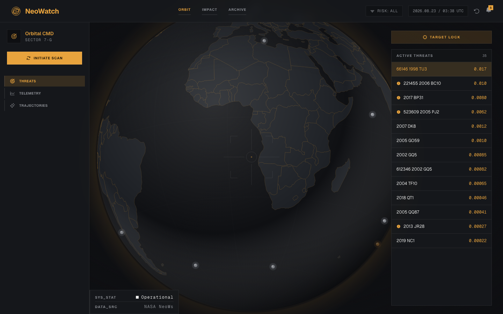

# NeoWatch

**Live frontend:** https://main.d2m0an0vcg1iwk.amplifyapp.com/

**Deployment:** Frontend is on AWS Amplify (see [frontend/README.md](frontend/README.md#deploying-to-aws-amplify)); backend deploy steps (AWS App Runner) are in [DEPLOY.md](DEPLOY.md).



NeoWatch pulls near-Earth object (NEO) data from NASA's public feed, stores it, estimates the impact energy of each close approach, and puts all of it on a live 3D dashboard — a photoreal Earth with tracked objects orbiting it, an impact-energy trend per asteroid, and hazard alerts — so you get "what's hazardous," "what's coming up," and "how has this asteroid's estimated impact energy trended over time" without hitting NASA's API yourself or building a UI for it.

## Contents

- [Features](#features)
- [Tech stack](#tech-stack)
- [System design](#system-design)
  - [Data model](#data-model)
  - [Endpoints](#endpoints)
- [Installation](#installation)
- [Usage](#usage)
- [Notes](#notes)
- [Contributing](#contributing)
- [License](#license)

## Features

**Backend**
- Daily ingest of NASA's NeoWs feed into Postgres (asteroids + their close approaches)
- Impact energy estimation — kinetic energy (`E = 1/2 m v²`) in megatons of TNT equivalent, snapshotted on every ingest so you get a trend, not just a live number. Returns `null` rather than a fabricated number when the underlying diameter/velocity data is missing or invalid, instead of throwing or guessing.
- One batched `/api/neo/dashboard` endpoint that returns everything the frontend needs in a single request, plus focused per-asteroid endpoints for approach history and impact-energy history
- Redis-cached reads, with cache invalidation tied to ingest
- CORS lockdown, per-IP rate limiting, and an optional shared-secret gate on the ingest endpoint — all open/off by default for local dev, real once you set the matching env vars

**Frontend**
- A real 3D Earth (Three.js/WebGL, not a static illustration or flat SVG projection) with NASA day/night/cloud/normal-map textures and a custom day-night terminator shader, tracked objects rendered as real irregular rocks orbiting it at a radius/speed derived from each one's actual miss distance and velocity, color-coded by hazard status, drag to rotate, click to select and tween the camera in
- Three destinations — **Home** (the 3D scene plus the selected object's summary), **Asteroids** (a sortable, filterable list of everything tracked), **Alerts** (the same list, pre-filtered to hazardous objects) — plus a per-asteroid detail page with full approach history and impact-energy trend over time
- Responsive by necessity, not an afterthought: desktop shows the full metrics card, status panel, and live Threats list alongside the globe; mobile collapses the selected object down to a single tappable summary chip, swipeable (or arrow-tappable) to cycle through tracked objects without leaving Home, so the globe stays the primary view, with navigation moved to a bottom tab bar
- **Telemetry** side panel — aggregate stats (average/min/max velocity, distance, diameter) across the currently tracked set
- Every asteroid shows its NASA ID and a plain-language explanation (with real-world comparisons like Hiroshima and Tunguska) of what the impact-energy number means and how it's calculated, plus an explicit energy-magnitude label (Low/Moderate/High/Extremely high) — never framed as a probability
- Hazardous-only filter. Data refreshes automatically once a day (see `/ingest` below) — there's no manual-refresh control in the UI, intentionally, since a visitor triggering NASA API calls on demand isn't something the app needs to expose

## Tech stack

**Backend** — Java 21, Spring Boot 4.1 (Web MVC, Data JPA, Validation, Cache, Scheduling), PostgreSQL, Redis, Lombok, Jackson 3, JUnit 5 + Mockito + MockMvc, Maven

**Frontend** — React 19 + Vite, Three.js (the 3D scene), Tailwind CSS v4, Motion, Phosphor Icons — plain JavaScript, no TypeScript or router

## System design

```
                    ┌─────────────────────┐
   @Scheduled       │                     │
   (midnight) ─────▶│   AsteroidService   │◀───── GET /ingest (manual trigger)
                     │                     │
                     └──────────┬──────────┘
                                │
                    ┌───────────┼────────────┐
                    ▼                        ▼
            ┌───────────────┐        ┌───────────────────┐
            │   NasaClient   │        │  Repositories       │
            │  (NASA NeoWs   │        │  (Asteroid,          │
            │   feed → JSON  │        │   CloseApproach,     │
            │   → entities)  │        │   RiskSnapshot)       │
            └───────────────┘        └─────────┬───────────┘
                                                 ▼
                                          ┌─────────────┐
                                          │  PostgreSQL  │
                                          └─────────────┘

            ┌────────────────┐
GET /api/neo/* ──▶│  NeoController │──▶ AsteroidService (read methods) ──▶ Redis cache ──▶ Postgres (on miss)
            └────────────────┘

  React frontend ──▶ CorsFilter ──▶ RateLimitFilter ──▶ IngestKeyFilter ──▶ Controllers
                      (WebConfig)   (per-IP, two tiers)  (/ingest only)
```

**Ingest path** — `IngestController` (manual, `GET /ingest`) and a `@Scheduled` cron job (`AsteroidService.ingestTodayAsteroids`, midnight daily) both call the same pipeline:

1. `NasaClient.fetchTodayAsteroids()` hits NASA's `/neo/rest/v1/feed` endpoint (despite the name, it returns a rolling 7-day window) and parses the raw JSON into `Asteroid` + `CloseApproach` objects. Parsing uses Jackson's `.path()` accessor rather than `.get()`, so a field NASA omits defaults instead of blowing up the whole batch.
2. `AsteroidService` **upserts** each asteroid (keyed on NASA's own `id`) and each close approach (keyed on `asteroid + approachDate`), so re-running ingest updates existing rows instead of duplicating them.
3. For every close approach, `AsteroidService` computes an impact energy estimate and inserts a new `RiskSnapshot` row — unlike the asteroid/approach upserts, snapshots always insert, so the same approach re-scored on a later ingest builds up a trend line instead of overwriting the last value.
4. Ingest evicts every read cache (`hazardousAsteroids`, `upcomingAsteroids`, `approachHistory`, `impactEnergy`, `impactEnergyHistory`, `dashboardRows`), since it's the only thing that ever changes the underlying data.

**Read path** — `NeoController` exposes read-only endpoints under `/api/neo`. Each maps to an `AsteroidService` method annotated `@Cacheable`, so repeat requests are served from Redis until the next ingest evicts them. `/api/neo/dashboard` is the frontend's main entry point: it joins the upcoming/hazardous asteroid sets to each one's next approach and current impact energy estimate in a single response, instead of the frontend making one request per asteroid.

**Security filters** — three servlet filters run in front of every request, in order: `CorsFilter` (restricts which origins may call the API), `RateLimitFilter` (120 req/min per IP on general reads, 10 req/min on `/ingest` and `/test-nasa` — the two endpoints that call the real NASA API), and `IngestKeyFilter` (requires a matching `X-Ingest-Key` header on `/ingest` if `INGEST_KEY` is configured). All three are safe no-ops until you set the corresponding environment variable.

**Impact energy formula** — the standard kinetic-energy formula, `E = 1/2 × m × v²`, expressed in megatons of TNT equivalent. Mass is estimated from `avg(estimatedDiameterMin, estimatedDiameterMax)` assuming a 3,000 kg/m³ bulk density (a documented mid-range estimate for a stony/S-type near-Earth object — NASA's feed gives diameter, not composition or mass). It deliberately ignores miss distance: kinetic energy is a property of the object and its speed, not of how close any one recorded pass was. `AsteroidService.calculateImpactEnergyMt` returns `null` rather than a fabricated number when the diameter or velocity it needs is missing or negative, or when the computed result isn't finite — the frontend renders that as "—" instead of a number. **This is an estimated kinetic-energy calculation, not an impact-probability model.** An actual probability of impact would require orbit-uncertainty data (e.g. NASA/JPL's Sentry system) that NeoWs close-approach data doesn't provide. It replaced an earlier `diameter × velocity ÷ distance` placeholder that had no physical basis.

### Data model

- **Asteroid** — one row per NASA object (`nasaId`, name, diameter range, hazardous flag). Not currently unique-constrained on `nasaId` at the DB level; dedup is enforced in the service layer.
- **CloseApproach** — one row per recorded approach event (`asteroid` FK, date, miss distance, relative velocity, orbiting body).
- **RiskSnapshot** — one row per impact energy calculation (`asteroid` + `closeApproach` FKs, `impactEnergyMt`, timestamp) — this is what makes `/impact-energy-history` a trend rather than a single number.

### Endpoints

| Method | Path | What it does |
|---|---|---|
| `GET` | `/api/neo/dashboard` | Everything the frontend needs in one call: every tracked asteroid joined to its next approach and current impact energy estimate |
| `GET` | `/api/neo/hazardous` | All asteroids NASA flagged as potentially hazardous |
| `GET` | `/api/neo/upcoming` | Asteroids with a recorded approach in the next 7 days |
| `GET` | `/api/neo/{id}/history` | Full close-approach history for one asteroid |
| `GET` | `/api/neo/{id}/impact-energy` | The single highest impact energy estimate (Mt TNT) across that asteroid's recorded approaches |
| `GET` | `/api/neo/{id}/impact-energy-history` | Every impact energy snapshot for that asteroid, oldest first |
| `GET` | `/ingest` | Manually triggers a NASA feed ingest (same pipeline as the midnight job). Requires `X-Ingest-Key` if `INGEST_KEY` is set. Not called from the UI — an ops/debugging hook for forcing a refresh without waiting for the cron job. |
| `GET` | `/test-nasa` | Smoke-tests NASA connectivity — returns the raw feed JSON, unparsed |

## Installation

### Prerequisites

- Java 21
- Node.js 20+ (for the frontend)
- A NASA API key ([api.nasa.gov](https://api.nasa.gov))
- A reachable PostgreSQL instance
- A reachable Redis instance

### Clone and configure

```bash
$ git clone https://github.com/abdullahmahfouz/Neo-Watch.git
$ cd Neo-Watch
```

Set these as environment variables (a `.env` file at the project root is picked up automatically via `spring-dotenv`):

```
NASA_API_KEY=
DB_URL=jdbc:postgresql://host:5432/dbname
DB_USERNAME=
DB_PASSWORD=
REDIS_HOST=
REDIS_PORT=
REDIS_PASSWORD=

# All optional — safe defaults, nothing to set for local dev.
ALLOWED_ORIGINS=http://localhost:5173   # comma-separated frontend origin(s) allowed to call the API
INGEST_KEY=                              # if set, GET /ingest requires a matching X-Ingest-Key header
TRUST_PROXY_HEADERS=false                # only set true once deployed behind a proxy that sets X-Forwarded-For itself
```

## Usage

### Run the backend

```bash
$ ./mvnw spring-boot:run
```

Starts on `localhost:8080`. Hit `GET /test-nasa` first to confirm your NASA key and network access work, then `GET /ingest` to populate the database.

### Run the frontend

```bash
$ cd frontend
$ npm install
$ echo "VITE_API_BASE_URL=http://localhost:8080" > .env.local
$ npm run dev
```

Starts on `localhost:5173` and calls the backend origin from `VITE_API_BASE_URL`.
See [frontend/README.md](frontend/README.md) for deployment notes.

### Test

```bash
$ ./mvnw test
```

Unit tests cover the ingest/upsert logic, impact energy estimation, NASA feed parsing, and the controller layer (via Mockito + Spring's MockMvc slices). `NeowatchApplicationTests` does a full context load against the configured Postgres/Redis instances.

## Notes

- `spring.jpa.hibernate.ddl-auto=update` auto-migrates the schema on boot — convenient while iterating solo, but swap for a real migration tool (Flyway/Liquibase) before this touches shared data.
- `Asteroid.nasaId` has no unique constraint at the DB level yet; concurrent ingests could race past the service-layer dedup check.
- `RateLimitFilter`'s per-IP tracking is an in-memory map with no eviction — fine at solo-project scale, would need a real cache (e.g. Caffeine) if this saw traffic from many thousands of distinct clients.

## Contributing

Solo project, no formal process yet. Bug reports and suggestions are welcome as issues.

## License

No license has been chosen for this project yet — all rights reserved by default until one is added.
